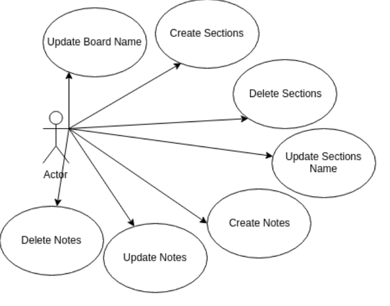
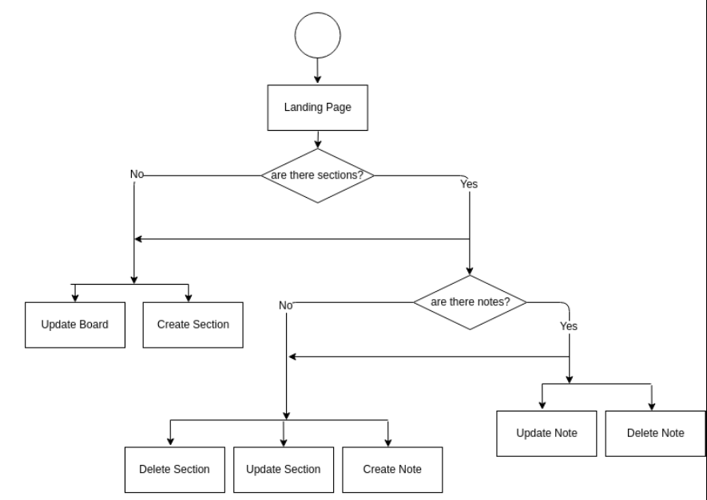
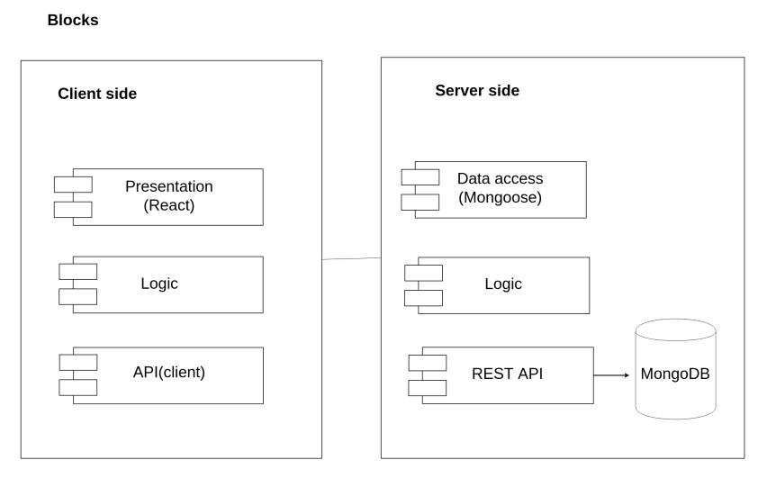
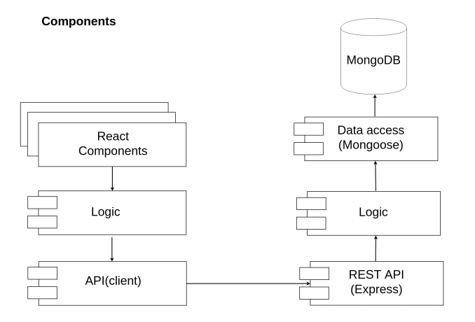
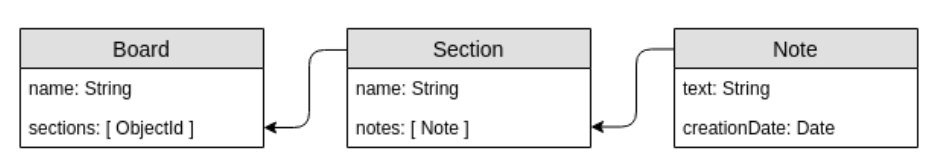
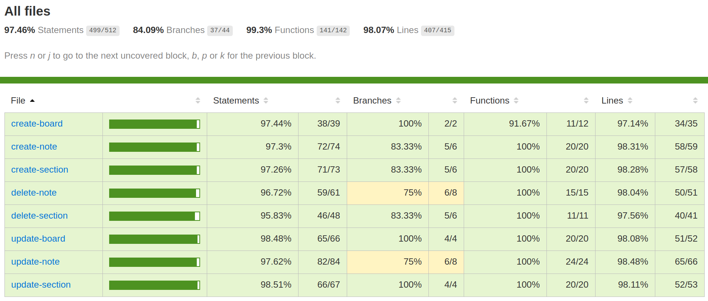
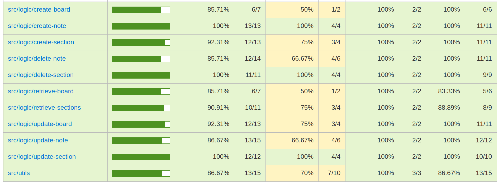

# Canvas-Board

# 

A project by:
*Martín García Blanco*

## Introduction

Canvas-Board is a demo inpired into trello.com or  https://www.business-model-canvas.app/#/ , the purpose is demonstrate my knowledge about MERN Stack

## Link to the project (mobile version): https://canvas-board.herokuapp.com

## Functional description

**Use cases**

**Flow chart**

## Technical description

**BLOCK DIAGRAM**

**COMPONENTS**

**DATA MODEL**

**API CODE COVERAGE (Mocha/Chai)**

**React-App CODE COVERAGE (Jest)**

**TECHNOLOGIES**

Javascript, ReactJS, Html5,SASS, Node.js, Express, MongoDB & Mongoose.

**TODO**
* Imlement user functionalities
* Improve retrieveSections(api logic)
* Code refactor
* Add error messages for each error
* Improve style for all platforms

